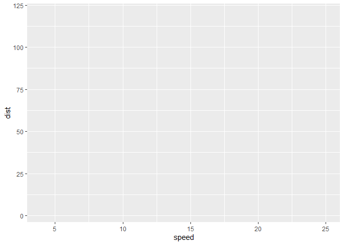
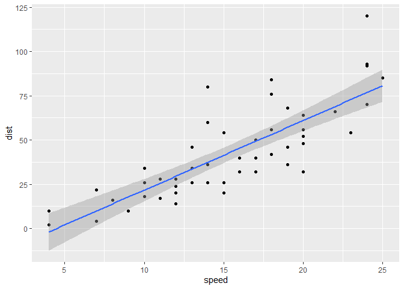
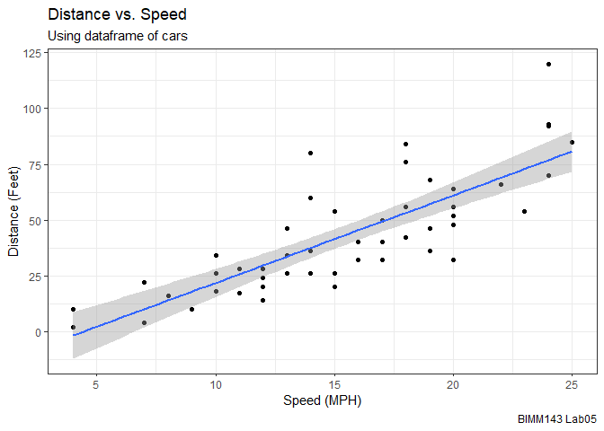
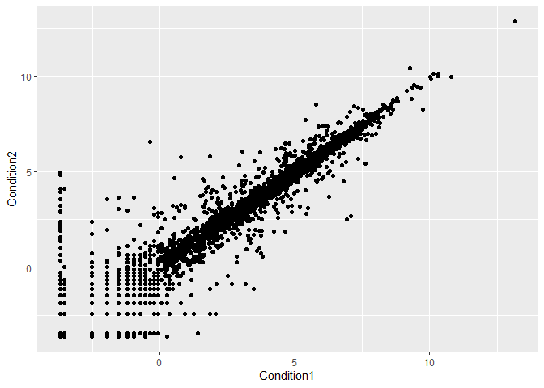
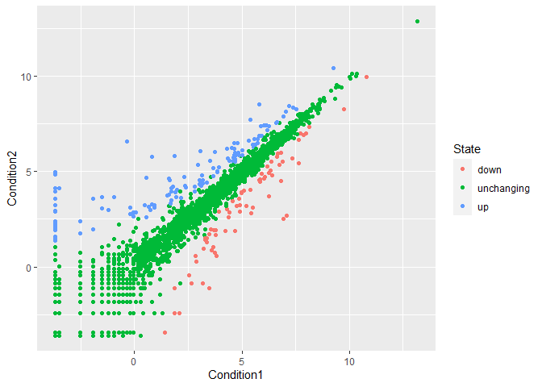
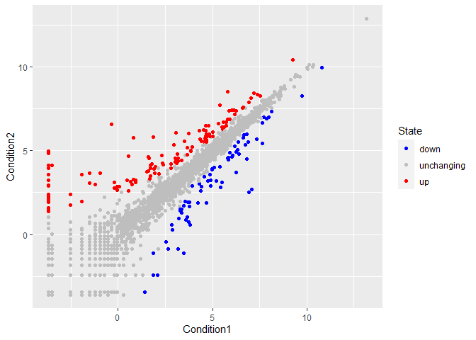
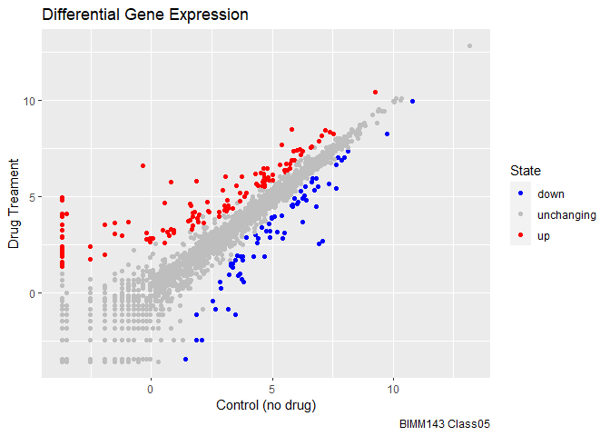

# Class 5: Data visualization with GGPlot
Michelle Woo
2023-04-19

# Base R plotting

We are going to start by generating the plot of class 04. This code is
plotting the **cars** `dataset: plot(cars)`

``` r
plot(cars)
```


# Ggplot2

First, we need to install the package (this is a one time thing!)

``` r
# install.packages('ggplot2')
```

After that, we need to load the package

``` r
library(ggplot2) 
```

Using the **cars** dataframe, we can generate a scatterplot using
ggplot2

``` r
ggplot(data = cars)
```


``` r
# add the aesthetics (labeling the x and y axis)
ggplot(data = cars) + aes(x=speed, y=dist)
```



``` r
# now add the geometry points to generate points in the graph, making sure to leave the () empty 
ggplot(data = cars) + aes(x=speed, y=dist) + geom_point()
```


``` r
# add a trendline
ggplot(data = cars) + aes(x=speed, y=dist) + geom_point() + geom_smooth()
```

    `geom_smooth()` using method = 'loess' and formula = 'y ~ x'


``` r
# using geom_smooth(method = 'lm'), this better fits the data
ggplot(data = cars) + aes(x=speed, y=dist) + geom_point() + geom_smooth(method = 'lm')
```

    `geom_smooth()` using formula = 'y ~ x'



``` r
# polish up the graph by adding labels and changing the theme
ggplot(data = cars) + aes(x=speed, y=dist) + geom_point() + geom_smooth(method = 'lm') + labs(title = 'Distance vs. Speed', subtitle = 'Using dataframe of cars', caption = 'BIMM143 Lab05', x = 'Speed (MPH)', y = 'Distance (Feet)') + theme_bw()
```

    `geom_smooth()` using formula = 'y ~ x'



**Q1.** For which phases is data visualization important in our
scientific workflows?

**Communication of Results, Exploratory Data Analysis, Detection of
Outliers**

**All of the above**

**Q2.** True or False? The ggplot2 package comes already installed with
R?

**False, using the install.packages command, ggplot2 will need to be
installed in R**

**Q3.** Which plot types are typically NOT used to compare distributions
of numeric variables?

**Network graphs**

**Q4.** Which statement about data visualization with ggplot2 is
incorrect?

**ggplot2 is the only way to create plots in R**

**Q5.** Which geometric layer should be used to create scatter plots in
ggplot2?

**geom_point()**

# Plotting gene expression data

Loading the data from the URL

``` r
url <- "https://bioboot.github.io/bimm143_S20/class-material/up_down_expression.txt"
genes <- read.delim(url)
head(genes)
```

            Gene Condition1 Condition2      State
    1      A4GNT -3.6808610 -3.4401355 unchanging
    2       AAAS  4.5479580  4.3864126 unchanging
    3      AASDH  3.7190695  3.4787276 unchanging
    4       AATF  5.0784720  5.0151916 unchanging
    5       AATK  0.4711421  0.5598642 unchanging
    6 AB015752.4 -3.6808610 -3.5921390 unchanging

Generate ggplot

``` r
#an initial ggplot
ggplot(data = genes) + aes(x=Condition1, y=Condition2) + geom_point()
```



**Q6.** Use the `nrow()` function to find out how many genes are in this
dataset. What is your answer **5196**

**Q7.** Use the `colnames()` function and the `ncol()` function on the
`genes` data frame to find out what the column names are (we will need
these later) and how many columns there are. How many columns did you
find? **4**

**Q8.** Use the `table()` function on the `State` column of this
data.frame to find out how many ‘up’ regulated genes there are. What is
your answer? **127 up regulated genes**

**Q9.** Using your values above and 2 significant figures. What fraction
of total genes is up-regulated in this dataset? **2.44**

Figuring out the amounts of data in the gene expression data

``` r
nrow(genes)
```

    [1] 5196

``` r
ncol(genes)
```

    [1] 4

``` r
colnames(genes)
```

    [1] "Gene"       "Condition1" "Condition2" "State"     

``` r
table(genes[,'State'])
```


          down unchanging         up 
            72       4997        127 

Adding color to the plot

``` r
p1 <- ggplot(data = genes) + aes(x=Condition1, y=Condition2, col=State) + geom_point()
p1
```



Changing the color scheme, adding some labels

``` r
p2 <- p1 + scale_color_manual(values = c('blue', 'gray', 'red'))
p2
```



``` r
# adding labels 
p2 + labs(title = 'Differential Gene Expression', x = 'Control (no drug)', y = 'Drug Treament', caption = 'BIMM143 Class05')
```


